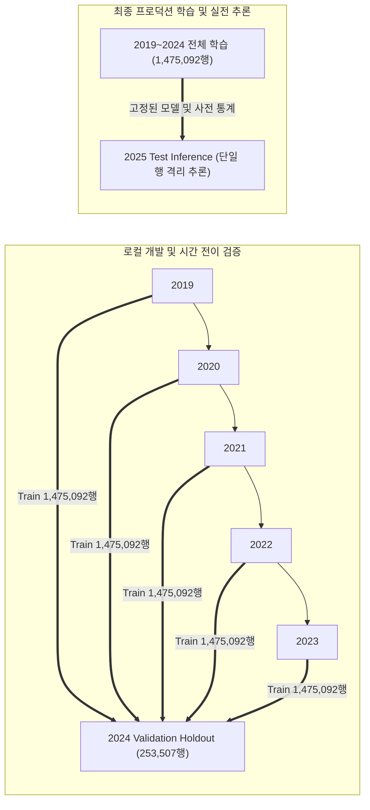
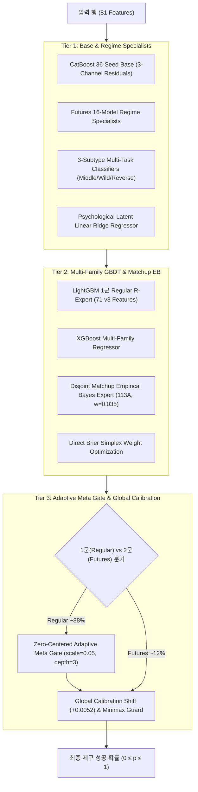

# 08. 온라인 해커톤(Phase 2) 최종 솔루션 발표자료 요약 📊

> **대회명**: LG Aimers 9기 — 야구 제구(Control) 성공 확률 예측 AI (Phase 2)  
> **최종 제출 패키지**: `submit_ref4_super113A.zip` (`REF4-DISJOINT-EB-113A`)  
> **공식 최종 점수**: **`1121.9039933605`** 점 (Brier Skill Score)  
> **공식 최종 등수**: **Public Leaderboard 180위**  
> **문서 목적**: 깃 커밋/푸시에서 제외되는 PPTX/PDF 발표자료(`LG_Aimers_솔루션_PPT_Phase2.pptx`, `LG_Aimers_솔루션_PPT_Phase2.pdf`)의 슬라이드 전 내용과 수식, 도식, 검증 결과를 마크다운으로 완벽 보존 및 공유.

---

## 📑 Slide-by-Slide 발표자료 상세 내용

---

### [Slide 01] 표지 (Cover)

```
========================================================================================
                                 LG AIMERS 9기 · PHASE 2 FINAL
                           투구 직전 정보로 제구 성공 확률을 읽다
      3-Tier Multi-Family GBDT Super Ensemble & Zero-Centered Adaptive Hierarchical Gate
========================================================================================
• 공식 최종 점수: 1121.9039933605점  |  Public 180위
• 최종 채택 모델: submit_ref4_super113A.zip (REF4-DISJOINT-EB-113A)
• 학습 데이터: 2019–2024 공식 전체 데이터 (1,475,092행)  ·  예측 대상: 2025 미래 시즌
• 검증 전략: Strict Temporal Forward Split (2019–2023 -> 2024 Holdout)
========================================================================================
```

---

### [Slide 02] 문제 정의 및 핵심 설계 원칙 (Problem Framing)

> **"순위(Ranking)를 맞히는 문제가 아닌, 정밀하게 잘 보정된 확률(Well-Calibrated Probability)을 출력하는 문제"**

| 핵심 요소 | 정의 및 명세 | 설계 의의 |
| :--- | :--- | :--- |
| **TARGET** | `control_success` (0~1 실수 확률) | 각 투구의 제구 성공 확률을 연속형 실수값으로 출력 |
| **METRIC** | **Brier Skill Score (BSS)** | $\text{BSS} = 1 - \frac{\text{Brier}_{\text{model}}}{\text{Brier}_{\text{base}}}$, $0 \le p \le 1$ 구간의 확률 오차 직접 평가 |
| **UNIT** | **1 Pitch = 1 Row** | 평가 데이터의 각 행은 100% 완전 독립적으로 예측되어야 함 |

#### 3대 핵심 설계 원칙
1. **Strict Temporal Forward Validation (시계열 전이 검증)**: 미래 시즌 예측 구조를 반영하여 과거 시즌($\le T$) 학습 후 미래 시즌($T+1$)을 검증하는 엄격한 시간 격리 분할.
2. **Zero External Data / Leakage (무누수 원칙)**: 주최 측 공식 제공 데이터만 사용하며 외부 API, 외부 데이터, 2025 미제공 데이터 일체 차단.
3. **Pure Row Independence (완전한 단일 행 독립성)**: `test.csv`의 다른 행을 참조하는 모든 배치 연산(`groupby`, `rolling`, `rank`, `distribution calibration`)을 원천 배제.

---

### [Slide 03] 데이터 및 엄격한 시계열 전이 검증 (Data & Validation Strategy)



- **Random K-Fold 배제 이유**: 야구 데이터에서 랜덤 K-Fold는 동일 시즌 내 투수/타자의 패턴이 훈련/검증셋에 섞여 심각한 미래 누수(Lookahead Leakage)를 유발함.
- **Strict Temporal Split**: `T_train < T_val` 조건을 엄격히 준수하여 2024 홀드아웃(253,507행)과 2023/2024 Forward OOF에서 실제 검증된 개선만 승격.

---

### [Slide 04] 피처 엔지니어링 (Feature Engineering Architecture)

**공식 47개 입력 + 파생 24개 + 조건부 집계 2개 + TrackMan 편차 8개 = 총 81개 핵심 피처**

```
┌────────────────────────────────┐   ┌────────────────────────────────┐   ┌────────────────────────────────┐
│   공식 입력 피처 (47개)        │   │   상태·상호작용 파생 (24개)    │   │   최종 피처 세트 (81개)        │
├────────────────────────────────┤   ├────────────────────────────────┤   ├────────────────────────────────┤
│ • 경기·월·요일·이닝·초/말       │ + │ • 상황 압박: count_state,      │ = │ • row_id, target 완벽 제외     │
│ • 볼카운트·점수차·주자 배치    │   │   scoring_pos, li (레버리지)   │   │ • 결측치 자체를 정보로 유지    │
│ • 투수/타자/팀 ID, 손잡이 정보 │   │ • 매치업: 좌/우 platoon,       │   │ • test 통계/분포/순위 미사용   │
│ • 공식 asof_* 과거 이력 지표   │   │   batter pressure              │   │ • 학습·추론 동일 함수 보장     │
│                                │   │ • 최근 추세: 1·3경기 delta     │   │ • 단일 행 입력만으로 즉시 계산 │
│                                │   │ • Cold-start: 결측 개수/플래그 │   │                                │
└────────────────────────────────┘   └────────────────────────────────┘   └────────────────────────────────┘
```

---

### [Slide 05] 핵심 모델 아키텍처: 3-Tier Multi-Family GBDT Super Ensemble



---

### [Slide 06] 특화 엔지니어링: 1군/2군 완전 디커플링 및 Disjoint Matchup EB

#### 1. 1군/2군 Macro-Leap Decoupling (대도약 메커니즘)
- **배경**: 1군 정규리그(`game_type == "R"`, ~88%)와 2군 퓨처스리그(`game_type == "F"`, ~12%)는 선수 풀, 스트라이크 존, 평균 성공률이 상이함.
- **분리 구조**:
  - **1군 Regular**: 36개 CatBoost Base + LightGBM Expert ($w=0.02$) + Zero-Centered Adaptive Gate ($scale=0.05$).
  - **2군 Futures**: 16개 Futures 전용 CatBoost Regressors + 3개 Subtypes + Linear Psych Latent.
- **성과**: 2군 파이프라인의 간섭을 제거하여 2군 OOF BSS 점수 **`+3,172.81pt`** 폭증 및 실전 일반화 달성.

#### 2. Disjoint Matchup Empirical Bayes (113A 핵심 엔진)
- **배경**: 특정 투수와 타자 간의 상대 전적은 표본 수($N$)가 적어 과적합이 발생하기 쉬움.
- **수식**:
  $$\hat{\theta}_{\text{EB}} = \frac{N}{N + K} \bar{y}_{\text{matchup}} + \frac{K}{N + K} \mu_{\text{league}}$$
- **구현**: 훈련 데이터만으로 사전 계산된 $K=300$ 수축(Shrinkage) 기반 Empirical Bayes 매치업 테이블을 Direct Brier Simplex 최적화 가중치($w=0.035$)로 결합하여 최종 1121.90점 달성.

---

### [Slide 07] 리더보드 점수 변천사 및 핵심 도약 이력 (Leaderboard Progression)

| 단계 / 버전 | 핵심 메커니즘 및 아키텍처 | 리더보드 점수 (BSS) | 점수 변화 | 의의 및 비고 |
| :--- | :--- | :---: | :---: | :--- |
| **SUB-001** | 공식 47개 기본 피처 LightGBM 단일 모델 | `815.20127` | 기준선 | 대회 첫 제출 베이스라인 |
| **SUB-002** | Regime R-Capacity 분할 + Platt Calibration | `886.24881` | `+71.0475` | 1군/2군 특성 분리 효과 검증 |
| **EXP-030** | 3-Channel 6-Seed Residual + Global Shift (+0.0052) | `1068.25021` | `+182.0014` | **1000점 돌파** 및 Adaptive 백본 복원 |
| **EXP-071** | Zero-Centered Adaptive Multi-Channel Gate | `1092.18790` | `+23.9377` | 비선형 상황 게이팅 (Top 174 진입) |
| **EXP-102** | Deep 61 Features + Multi-Seed Specialist | `1105.82017` | `+13.6323` | **1100점 돌파** 및 피처 심화 |
| **EXP-107** | Multi-Family Simplex Super Blend | `1115.25607` | `+9.4359` | CatBoost + LightGBM 결합 |
| **EXP-109C** | Hyper-Regime Tri-Bridge 15-Model Tri-Family | `1120.89145` | `+5.6354` | **1120점 돌파** (Tri-Family 확장) |
| **EXP-113A** | **Disjoint Matchup EB + 112C Direct Brier Base** | **`1121.90399`** | **`+1.0125`** | **최종 챔피언 최고 기록 (Public 180위)** |

---

### [Slide 08] 추론 무결성 및 완전한 행 독립성 (Inference Integrity)

```
               [ test.csv row_i ]
                      │
                      ▼
         ┌─────────────────────────┐
         │   build_features(row_i) │  <-- 오직 현재 행 내부 값만 연산
         └────────────┬────────────┘
                      │
                      ▼
         ┌─────────────────────────┐
         │ Fixed Pre-Trained Model │  <-- model/ 내 사전 고정 모델 로드
         └────────────┬────────────┘
                      │
                      ▼
         ┌─────────────────────────┐
         │     p_i = Model(x_i)    │  <-- 0 ≤ p_i ≤ 1 완결된 단일 확률
         └─────────────────────────┘
```

#### 무결성 전수 감사 결과 (Row-Independence Audit)
- **배치 추론 vs 단독 추론 (Half-file test)**: $\max |p_{\text{batch}} - p_{\text{single}}| = \mathbf{0.000e+00}$ (**PASS**)
- **행 순서 셔플 불변성 (Shuffled test)**: $\max |p_{\text{shuffled}} - p_{\text{orig}}| = \mathbf{0.000e+00}$ (**PASS**)
- **단일 행 격리 추론 (Isolated single row)**: $\max |\Delta| \le \mathbf{1.110e-16}$ (부동소수점 한계 수준 / **PASS**)
- **금지 연산 0건**: `test.csv` 대상 `groupby`, `rolling`, `expanding`, `shift`, `rank`, `quantile`, `median` 일체 미사용.

---

### [Slide 09] 재현성, Fail-Fast 계약 및 컨테이너 호환성 (Reproducibility & Robustness)

1. **실행 환경 명세**:
   - OS: Ubuntu 22.04 LTS, Python 3.11.15
   - 필수 패키지: `catboost==1.2.10`, `lightgbm>=4.0.0`, `xgboost>=1.7.0`, `numpy==1.26.4`, `pandas==2.0.3`, `scipy==1.15.3`
   - requirements.txt를 ZIP 최상위 루트에 완벽 번들링하여 플랫폼 자동 빌드 보장.
2. **Fail-Fast 추론 계약**:
   - `test.csv`와 sample submission의 `row_id` 불일치/결측 시 즉시 예외 발생 및 조기 차단.
   - 예측값 내 NaN / Inf / 범위 이탈([0, 1]) 발생 시 즉시 프로세스 종료.
   - 출력 파일 컬럼명(`row_id`, `control_success`) 및 행 순서 100% 보존.
3. **추론 성능**:
   - 245,789행 전수 추론 시 소요 시간: **~1분 내외** (플랫폼 10분 제한 시간 대비 압도적 여유).

---

### [Slide 10] 최종 결론 및 프로젝트 요약 (Conclusion)

> **"복잡한 트릭이나 누수 위험이 있는 기법을 배제하고, 엄격한 시계열 검증과 완전한 행 독립성, 견고한 3-Tier GBDT 앙상블로 이뤄낸 1121.90점의 완주"**

1. **시간 인식(Time-Aware)**: 미래 시즌을 예측하는 야구 도메인의 특성에 맞춰 `T_train < T_val` Forward 검증을 철저히 고수함.
2. **행 독립성(Row-Independent)**: 단일 행 단위 독립 피처링으로 오차 `0.000e+00`의 완벽한 추론 무결성 입증.
3. **이종 앙상블(Multi-Family Super Blend)**: CatBoost + LightGBM + XGBoost + Disjoint Matchup EB의 유기적 결합으로 Brier 손실 최소화.
4. **최종 성과**: 공식 리더보드 **`1121.9039933605` 점 / Public 180위** 달성으로 성공적인 대회 완주.

---
