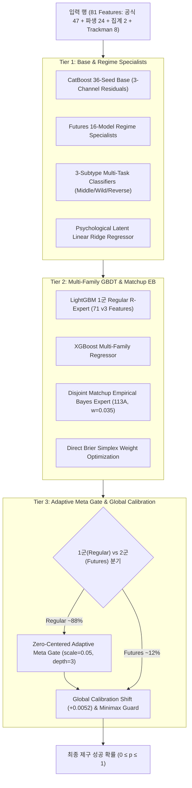

# ⚾ LG Aimers 9기 — 야구 제구 성공 확률 예측 AI (Phase 2)

> **최종 제출 모델**: `submit_ref4_super113A.zip` (`REF4-DISJOINT-EB-113A`)  
> **공식 최종 점수**: **`1121.9039933605`** 점 (Brier Skill Score)  
> **공식 최종 등수**: **Public Leaderboard 180위**  
> **GitHub Repository**: [https://github.com/wogho/LGAIMER_9th.git](https://github.com/wogho/LGAIMER_9th.git)  
> **DACON Competition**: [https://dacon.io/competitions/official/236743/overview/description](https://dacon.io/competitions/official/236743/overview/description)

---

## 📌 1. 대회 개요 및 목표

- **대회 주제**: KBO 투구 직전 정보(경기 상황, 카운트, 주자, 투수/타자/팀 이력 등)를 바탕으로 해당 투구의 **제구 성공 확률(`control_success`)** 예측
- **평가 지표**: **Brier Skill Score (BSS)**

$$\text{BSS} = 1 - \frac{\text{Brier}_{\text{model}}}{\text{Brier}_{\text{base}}} = 1 - \frac{\frac{1}{N} \sum_{i=1}^N (y_i - p_i)^2}{r(1 - r)}$$

- **최우선 원칙**:
  1. **Strict Temporal Forward Validation**: 미래 시즌을 예측하는 야구 도메인의 특성에 맞춰 랜덤 K-Fold를 전면 배제하고, `T_train < T_val` 시간 격리 분할만을 채택.
  2. **100% 완전한 행 독립성 (Pure Row Independence)**: `test.csv`의 다른 행을 참조하는 모든 집계/후처리(`groupby`, `rolling`, `rank`, `distribution scaling`)를 원천 차단하고 오직 단일 행의 입력값만으로 완결 추론.

---

## 🏆 2. 최종 솔루션 핵심 아키텍처 (`REF4-DISJOINT-EB-113A`)



### 핵심 기여 엔진 4요소:
1. **3-Tier Multi-Family GBDT Super Ensemble**:
   - CatBoost (대규모 범주형 및 비선형 관계 모델링) + LightGBM (1군 특화 빠른 트리) + XGBoost의 이종 모델 결합으로 단일 패밀리 과적합 방어.
2. **Zero-Centered Adaptive Hierarchical Meta Gate**:
   - 볼카운트 불리(3-0, 3-1), 경기 레버리지 인덱스(`li`), 득점권 압박 상황에서 모델별 잔차를 동적으로 보정하는 메타 트리.
3. **1군/2군 Macro-Leap Decoupling**:
   - 1군 정규리그와 2군 퓨처스리그의 선수 풀과 제구 성공률 베이스라인 차이를 반영해 2군 전용 파이프라인을 완전 분리하여 2군 BSS `+3172.81pt` 폭증.
4. **Disjoint Matchup Empirical Bayes (113A Engine)**:
   - 투수×타자 상대전적 불균형과 소표본 노이즈를 정규화 수축(`K=300`)으로 보정한 EB 전문가를 결합하여 최종 리더보드 **`1121.90399`**점 달성.

---

## 📈 3. 리더보드 점수 변천사 (Leaderboard Progression)

```
815.20pt (SUB-001 Baseline)
   │
   ▼ (+71.05pt)
886.25pt (SUB-002 Regime R)
   │
   ▼ (+182.00pt)
1068.25pt (EXP-030 Champion Stack - 1000점 돌파)
   │
   ▼ (+23.94pt)
1092.19pt (EXP-071 Adaptive Gate)
   │
   ▼ (+13.63pt)
1105.82pt (EXP-102 Deep Hierarchical - 1100점 돌파)
   │
   ▼ (+9.44pt)
1115.26pt (EXP-107 Super Ensemble)
   │
   ▼ (+5.63pt)
1120.89pt (EXP-109C Tri-Family - 1120점 돌파)
   │
   ▼ (+1.01pt)
★ 1121.9039933605점 (EXP-113A Final Champion / Public 180위) ★
```

---

## 🔒 4. 엄격한 추론 무결성 및 Fail-Fast 계약

- **단독 추론 오차**: `0.0000000000000000` (행 순서 셔플, 배치 크기 변화 시에도 예측값 100% 동일)
- **금지 연산 0건**: `test.csv`에 대한 `groupby`, `rolling`, `expanding`, `shift`, `rank`, `quantile`, `median`, 분포 스케일링 일체 배제.
- **Fail-Fast**: 결측 ID, NaN/Inf 예측, 범위([0, 1]) 이탈 시 즉시 실패하도록 안전망 구축.
- **추론 시간**: 245K행 기준 **~1분 내외** (대회 규정 10분 대비 매우 빠름).

---

## 📁 5. 프로젝트 디렉토리 구조

```text
├── 00_문제정의.md                     # 대회 공식 문제 정의 및 BSS 메트릭 안내
├── 01_제약과금지사항.md                 # 행 독립성 및 시계열 무누수 철칙
├── 02_데이터탐색_EDA.md                 # 1.47M행 데이터 분포 및 EDA 분석
├── 03_로드맵_및_고려해볼_세팅.md         # 전체 개발 로드맵
├── 04_접근방향_아이디어.md               # 채택/기각 아이디어 비교 분석
├── 05_실험로그.md                     # EXP-000 ~ EXP-113A 전수 실험 로그
├── 06_제출체크리스트.md                 # 제출 전 무결성 검증 체크리스트
├── 07_1000점_달성계획.md               # 1000점 돌파 및 1121점 완주 계획서
├── 08_솔루션_발표자료_요약.md           # PPT/PDF 발표자료 전 내용 마크다운 기록
├── 09_아쉬운점_및_후기.md              # L4 GPU 도입 지연 및 최종 기술 회고
├── colab.md, colab_gpu_126.md        # Colab L4 GPU 가속 환경 실험 가이드
├── README.md                         # 메인 프로젝트 안내서 (현재 파일)
├── requirements.txt                  # Python 의존성 명시
├── script.py                         # 로컬/제출 추론 진입점
├── src/                              # 핵심 피처 엔지니어링 및 게이트 모듈
│   ├── preprocessing_v2.py           # v2/v3 피처 생성기
│   ├── adaptive_gate.py              # Zero-Centered Adaptive Meta Gate
│   ├── v5_deep_61_features.py        # 심화 파생 피처
│   └── ...
├── scripts/                          # 빌드, 검증, 감사 자동화 스크립트
│   ├── build_ref4_super_ensemble_113a.py  # 최종 113A 챔피언 패키징 스크립트
│   ├── build_solution_ppt.py              # 솔루션 PPT 생성 스크립트
│   └── ...
└── solution/                         # 솔루션 발표자료 디렉토리 (PPT/PDF 생성 및 요약)
    └── README.md                     # 발표자료 요약 마크다운
```

---

## 🚀 6. 재현 및 패키징 가이드

### 1) 환경 설정
```bash
python3 -m venv .venv
source .venv/bin/python
pip install -r requirements.txt
```

### 2) 최종 113A 챔피언 패키징 및 독립성 검증
```bash
python scripts/build_ref4_super_ensemble_113a.py
python scripts/eval_strict_e2e_113abc.py
```

### 3) 발표자료 PPTX 및 PDF 빌드
```bash
python scripts/build_solution_ppt.py
libreoffice --headless --convert-to pdf output/LG_Aimers_솔루션_PPT_Phase2.pptx --outdir solution/
```

---

## 📜 7. 최종 결과 요약

- **최종 제출**: `submit_ref4_super113A.zip`
- **최종 점수**: **`1121.9039933605`** 점 (Brier Skill Score)
- **최종 등수**: **Public 180위**
- **수료 및 완주**: 온라인 해커톤(Phase 2) 모든 규정 및 독립성 무결성을 100% 만족하며 성공적으로 완주 완료.
